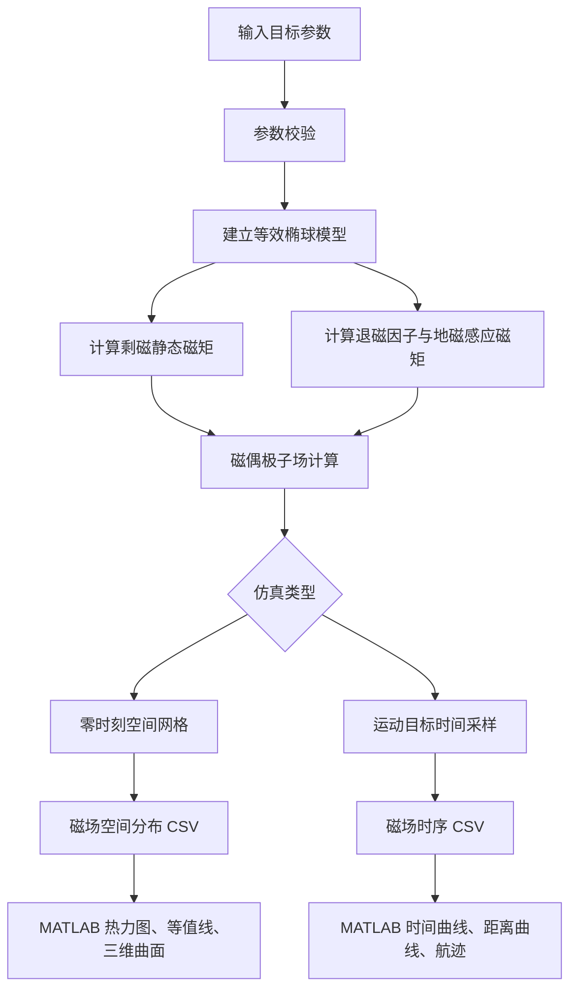

# 打击目标磁场特性接口说明

本文档约定舰艇、潜艇目标静磁场分布和地磁感应磁场三分量的数据接口。当前工程提供 C++ 计算模型和 CSV 示例，HTTP 地址是供后续服务封装使用的推荐格式。

## 模拟流程

磁场模拟从目标参数和地磁环境开始，先建立等效静态磁矩与感应磁矩，再根据使用场景生成空间网格或运动时序数据，最后输出 CSV 供 MATLAB 绘图。



流程中的综合磁场是目标剩磁异常磁场与地磁感应异常磁场的矢量和，不包含作为环境背景输入的地磁场本身。如需模拟传感器测得的绝对磁场，应在综合目标异常磁场上再叠加 `geomagneticFieldNt`。

## 一、模型能力与坐标

- 输入目标类型、长度、宽度、高度、中心位置和三轴姿态。
- 输入航速，使目标从零时刻位置沿舰首方向匀速运动。
- 输入地磁场东、北、上三分量，以及目标等效相对磁导率。
- 输入目标坐标系中的剩磁强度三分量。
- 计算任意观测点或规则空间网格上的静磁场、感应磁场与综合目标异常磁场。
- 所有磁场输出单位为 `nT`，坐标单位为 `m`。

坐标约定：x 向东、y 向北、z 向上，水下 z 为负数。地磁 z 分量为负数表示磁场指向地球内部。

## 二、推荐接口

| 接口 | C++ 函数 | 用途 |
|---|---|---|
| `POST /api/v1/magnetic-field/calculate` | `model.calculate(position)` | 计算单个观测点 |
| `POST /api/v1/magnetic-field/simulate` | `model.simulate(position, start, duration, rate)` | 生成固定传感器磁场时序 |
| `POST /api/v1/magnetic-field/spatial-grid` | `model.simulateGrid(grid)` | 生成二维或三维磁场分布 |

## 三、空间分布请求

```json
{
  "target": {
    "type": "surfaceShip",
    "lengthM": 100.0,
    "widthM": 15.0,
    "heightM": 10.0,
    "center": { "x": 0.0, "y": 0.0, "z": -5.0 },
    "velocityMps": 0.0,
    "headingDegrees": 20.0,
    "pitchDegrees": 0.0,
    "rollDegrees": 0.0
  },
  "magnetism": {
    "geomagneticFieldNt": { "x": 18000.0, "y": 30000.0, "z": -42000.0 },
    "relativePermeability": 180.0,
    "magneticMaterialRatio": 0.035,
    "remanentMagnetizationAm": { "x": 7.5, "y": 0.8, "z": -0.4 },
    "minimumDistanceM": 2.0
  },
  "grid": {
    "minimum": { "x": -250.0, "y": -150.0, "z": -30.0 },
    "maximum": { "x": 250.0, "y": 150.0, "z": -30.0 },
    "xCount": 101,
    "yCount": 61,
    "zCount": 1
  }
}
```

长度、宽度、高度必须大于 0；相对磁导率必须不小于 1；磁性材料等效体积占比必须在 `(0, 1]` 内。`minimumDistanceM` 是观测点到目标中心的额外最小距离。模型还会结合目标长、宽、高和当前姿态建立等效三轴椭球，拒绝椭球内部及表面上的观测点。网格三个方向的点数都必须大于 0，且总点数不能超过 100 万。

上例把 z 的上下限都设为 `-30`，并设置 `zCount=1`，因此生成水下 30 米水平面的二维磁场分布。需要三维分布时，设置不同的 z 上下限和大于 1 的 `zCount`。

## 四、响应结构

```json
{
  "metadata": {
    "fieldUnit": "nT",
    "distanceUnit": "m",
    "xCount": 101,
    "yCount": 61,
    "zCount": 1,
    "flattenOrder": "z-y-x"
  },
  "samples": [
    {
      "position": { "x": -250.0, "y": -150.0, "z": -30.0 },
      "distanceM": 292.617,
      "staticField": { "x": 0.0, "y": 0.0, "z": 0.0, "magnitude": 0.0 },
      "inducedField": { "x": 0.0, "y": 0.0, "z": 0.0, "magnitude": 0.0 },
      "totalField": { "x": 0.0, "y": 0.0, "z": 0.0, "magnitude": 0.0 }
    }
  ]
}
```

`samples` 按 z、y、x 的顺序展开，x 变化最快。静磁场来自目标剩磁，感应磁场来自地磁对目标的磁化，综合场是两者的矢量和。

## 五、前端绘图字段

| 图形 | 颜色字段 |
|---|---|
| 静磁场强度热力图 | `samples[].staticField.magnitude` |
| 感应磁场强度热力图 | `samples[].inducedField.magnitude` |
| 感应磁场东向分量 | `samples[].inducedField.x` |
| 感应磁场北向分量 | `samples[].inducedField.y` |
| 感应磁场垂向分量 | `samples[].inducedField.z` |
| 综合目标异常磁场 | `samples[].totalField.magnitude` |

三分量字段带正负号，适合使用以 0 为中心的发散色带；模值始终非负，适合顺序色带。

## 六、运动目标磁场时序

固定磁传感器位置，并让目标按航向匀速通过时，可以请求连续磁场信号：

```json
{
  "target": {
    "type": "surfaceShip",
    "lengthM": 100.0,
    "widthM": 15.0,
    "heightM": 10.0,
    "center": { "x": -300.0, "y": 40.0, "z": -5.0 },
    "velocityMps": 8.0,
    "headingDegrees": 0.0,
    "pitchDegrees": 0.0,
    "rollDegrees": 0.0
  },
  "sensorPosition": { "x": 0.0, "y": 0.0, "z": -30.0 },
  "sampling": {
    "startTimeSeconds": 0.0,
    "durationSeconds": 75.0,
    "sampleRateHz": 20.0
  }
}
```

目标中心位置按下式更新：

```text
当前位置 = 零时刻中心位置 + 舰首方向单位矢量 × 航速 × 时间
```

时序响应中的每个样本包含：

- `timeSeconds`：当前仿真时刻。
- `targetPosition`：目标当前中心位置。
- `sensorPosition`：固定传感器位置。
- `distanceM`：目标到传感器的距离。
- `staticField`、`inducedField`、`totalField`：三类磁场的 x、y、z 分量与模值。

MATLAB 绘制随时间变化的三分量曲线时，横轴使用 `timeSeconds`，纵轴分别使用 `totalField.x`、`totalField.y` 和 `totalField.z`；绘制场强包络时使用 `totalField.magnitude`。

## 七、模型适用范围

当前实现是目标外部磁场的等效椭球—磁偶极子模型。模型按照目标长、宽、高及姿态拒绝等效三轴椭球内部和表面上的观测点，并保留 `minimumDistanceM` 作为目标中心距离的额外安全下限。该校验只能阻止明显无效的计算；观测点即使刚好位于椭球外部，单偶极子仍可能无法描述局部磁场细节。工程应用应使用多偶极子、有限元结果或实测数据进行标定。
